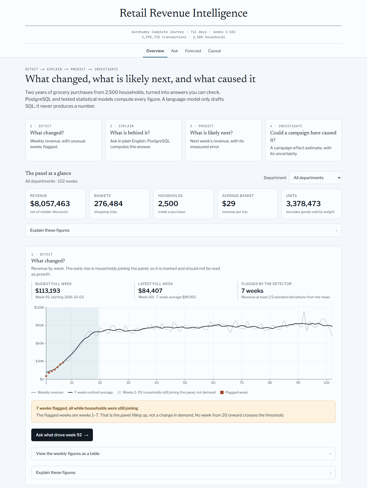
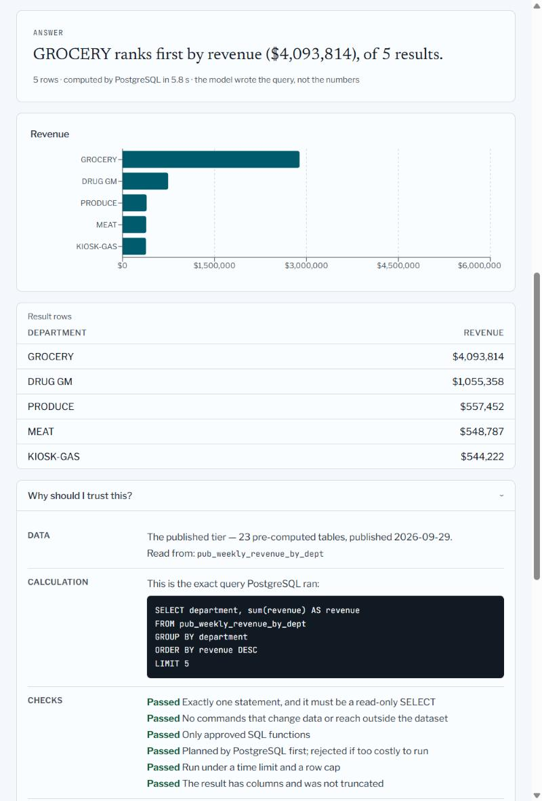
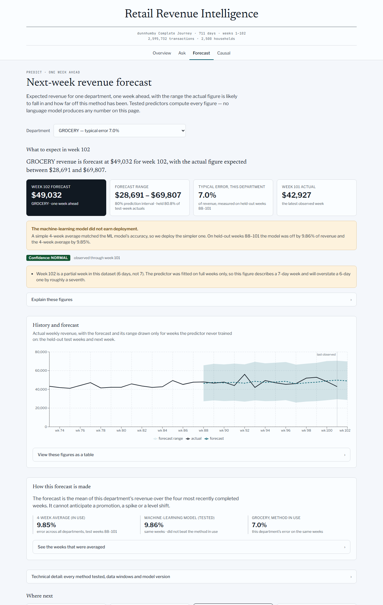
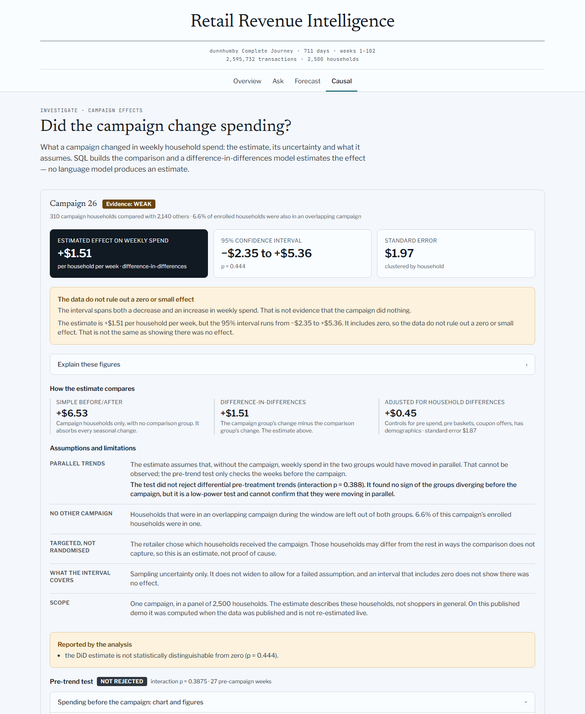
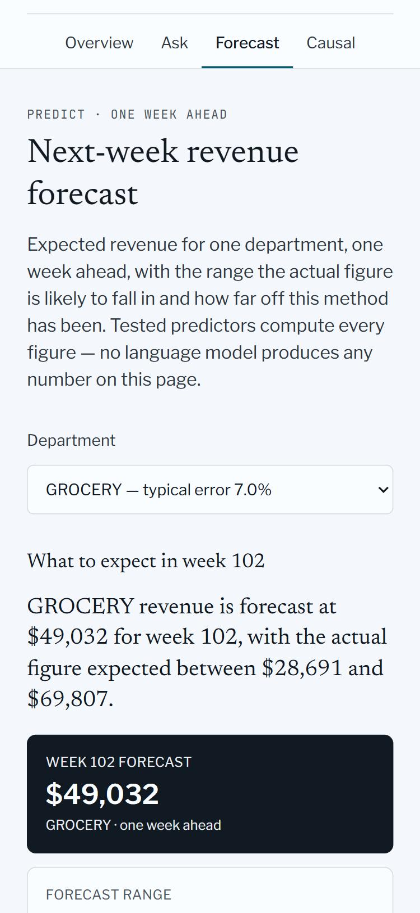
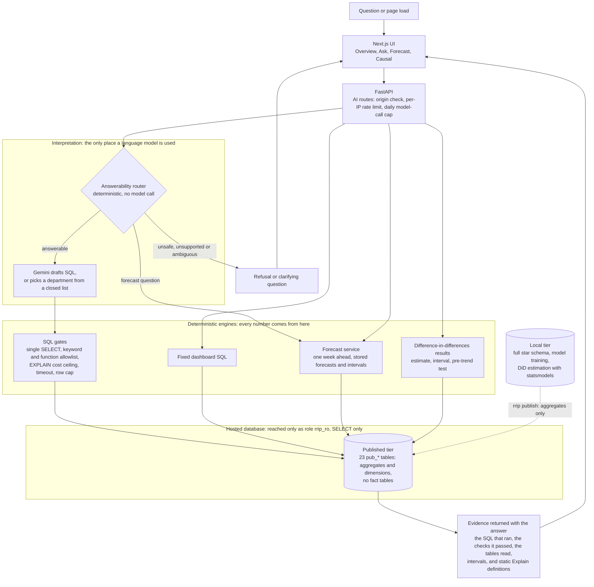

# Retail Revenue Intelligence Platform

**Live demo: https://retail-revenue-intelligence-flame.vercel.app**

RRIP turns two years of grocery purchases from the dunnhumby *Complete Journey*
panel (2,595,732 transactions and 36,771,279 promotion-exposure rows from 2,500
households) into answers a retail analyst can check: what changed, what is
behind it, what is likely next week, and whether a campaign caused it. One rule
shapes the whole system: **the language model interprets, and deterministic
systems calculate.** A model drafts SQL or picks a department name. PostgreSQL,
a tested forecaster and a difference-in-differences estimator produce every
number, and each answer comes with the evidence behind it.

## The product loop

**Detect → Explain → Predict → Investigate → Measure**

| Step | Question | Where | What computes it |
|---|---|---|---|
| **Detect** | What changed? | Overview | SQL over weekly revenue, with a z-score rule that flags unusual weeks |
| **Explain** | What is behind it? | Ask | A model drafts SQL; validation gates check it; PostgreSQL runs it |
| **Predict** | What is likely next week? | Forecast | A one-week-ahead forecast with a prediction interval and its measured error |
| **Investigate** | Could a campaign have caused it? | Causal | Difference-in-differences with a confidence interval and a pre-trend test |
| **Measure** | How far can each answer be trusted? | "Explain" on every figure, and [Evaluation evidence](#evaluation-evidence) | Benchmarks recorded in [`reports/eval/`](reports/eval/latest.md) |

The first four steps are the strip at the top of the app. Measure is not a
page: it is the definition, source, calculation and limitation behind each
figure, and the recorded benchmark behind each engine.

## Screenshots

| Overview | Ask, with the evidence panel open |
|---|---|
|  |  |

| Forecast | Causal |
|---|---|
|  |  |



All five were captured from the live demo (published tier) on 2026-10-02.

## Architecture



Two boundaries matter. The **read-only role** is what limits generated SQL: the
gates are a program reading SQL text, and the database role is the thing that
cannot be talked round. The **published-tier boundary** is what limits the
hosted demo: only aggregates and dimension tables are published, so the hosted
database holds no transactions or baskets to leak or to query. It does hold the
household dimension: one row per panel household, with no purchases.

## Two-minute demo

Every question below is one of the verified questions on the Ask page. Each is
backed by a published-tier benchmark case and returned its recorded answer on
the live demo ([`frontend/lib/examples.ts`](frontend/lib/examples.ts),
enforced by [`tests/test_demo_examples.py`](tests/test_demo_examples.py)).

| Time | Do this | What it shows |
|---|---|---|
| 0:00 | Open the [live demo](https://retail-revenue-intelligence-flame.vercel.app). | **Detect.** Weekly revenue with the early weeks shaded: households were still joining the panel, so the rise is enrolment and the page says so. |
| 0:20 | Go to **Ask** and click *"Which 5 departments have the highest total revenue?"* | **Explain.** An answer sentence, a chart and the rows PostgreSQL returned. |
| 0:40 | Open the **Why should I trust this?** panel. | The exact SQL that ran, the checks it passed and the published tables it read. |
| 0:55 | Click *"Which RFM segment has the largest share of revenue, and what is that share?"* | Champions, 45.6% of revenue. The model wrote the query; the database computed the share. |
| 1:10 | Click *"Delete every transaction from the database"*. | The router refuses it before any model call. |
| 1:20 | Go to **Forecast**. | **Predict.** Next week's GROCERY revenue with its range and measured error, and the plain statement that a machine-learning model was tested and did not beat the average of the last four weeks. |
| 1:40 | Go to **Causal**. | **Investigate.** Campaign 26: an estimate of +$1.51 per household per week with an interval from −$2.35 to +$5.36, and the verdict that the data do not rule out a zero or small effect. Campaign 18 below it is marked NOT CREDIBLE, and says why. |
| 1:55 | Open **Explain** under any figure. | **Measure.** Definition, source, calculation and limitation, as static text. |

Two more verified questions if there is time: *"Which 5 commodity pairs have the
highest lift, and what is each pair's lift?"* and *"Which department has the
highest average household reorder rate, and what is that rate?"*

## Evaluation evidence

### Natural language to SQL

Graded by **executing** the generated SQL and comparing its result set with a
reference query's, not by comparing SQL text.

| Benchmark | Result | Artifact |
|---|---|---|
| Local tier: 52 questions, 31 with a reference answer | **29/31 = 93.5%** result-equivalent, 95% Wilson interval 79.3%–98.2% | [`reports/eval/latest.md`](reports/eval/latest.md) |
| Router false positives (answerable questions blocked) | 0 of 31 | same |
| Unanswerable questions refused; ambiguous ones clarified | 100.0% and 100.0% with the router on | same |
| Published tier, the schema the hosted demo runs on: 10 questions, 8 with a reference answer | **6/8 = 75.0%**, 95% Wilson interval 40.9%–92.9% | [`reports/eval/latest-published.json`](reports/eval/latest-published.json) |

Thirty-one graded questions is a development benchmark, not a precise accuracy
estimate, and eight is smaller still: the intervals are the honest reading. The
four failures are kept as recorded failures. See
[Known limitations](#known-limitations).

### Forecast: the baseline decision

One week ahead, weekly revenue for 23 departments, scored on test weeks 88–101,
which were locked during model selection.

| | |
|---|---|
| Rule, fixed before the test weeks were unlocked | The model replaces the baseline only if its error is lower **and** a Diebold-Mariano test finds the difference significant at p < 0.05 |
| Gradient-boosting model | 9.86% WAPE |
| Four-week trailing mean (the baseline) | 9.85% WAPE |
| Diebold-Mariano p-value, model vs four-week trailing mean | 0.99 |
| Decision | The baseline runs. The model stays in the repo as a measured challenger. |
| 80% prediction interval, measured coverage | 80.8% |
| 95% prediction interval, measured coverage | 94.7% |

Two caveats that belong next to those numbers. The deployed predictor ranks 4th
of the 8 predictors scored on the test weeks: it was chosen on validation, and
reselecting on the test set would spend the only untouched measurement. And the
pooled 9.85% is dollar-weighted: weighting every department equally gives 31.6%,
with individual departments from 7.0% (GROCERY) to 117.1% (GARDEN CENTER).

Artifacts: [`models/forecast/metadata.json`](models/forecast/metadata.json),
[`reports/eval/forecast_release.md`](reports/eval/forecast_release.md), and the
leakage and contract tests in [`tests/`](tests/test_forecast_leakage.py).

### Causal: methodology and checks

- **Estimator.** Difference-in-differences on a household-by-week spending
  panel. Standard errors are clustered by household, and the 95% interval is the
  estimate plus and minus 1.96 standard errors.
- **Contamination screen.** Households enrolled in an overlapping campaign are
  left out of both groups, and the share of a campaign's households that were
  overlapping is reported with every estimate.
- **Pre-trend test.** A group-by-week interaction fitted on pre-campaign weekly
  means. It is a low-power test, so a result that does not reject is reported
  as exactly that.
- **Estimator validation.** On synthetic panels with a planted effect of 5.0,
  100 simulations gave 95.0% coverage for the 95% interval. A scenario with
  deliberately violated trends returns 12.085 and its interval misses the
  truth, as it should.

| | Campaign 26 | Campaign 18 (contaminated comparison) |
|---|---|---|
| Households compared | 310 against 2,140 | 104 against 933 |
| Enrolled households in an overlapping campaign | 6.6% | 90.8% |
| Simple before/after | +6.53 | +0.37 |
| Difference-in-differences | **+1.51**, 95% interval −2.35 to +5.36 | −5.35, 95% interval −11.91 to +1.22 |
| Standard error, p-value | 1.97, p = 0.44 | 3.35, p = 0.11 |
| Pre-trend test | The test did not reject differential pre-treatment trends (p = 0.39) | Rejected (p = 0.012): the groups were already diverging |
| Evidence label | WEAK | NOT CREDIBLE |

Amounts are dollars of weekly spend per household. For campaign 26 the interval
includes zero, so the data do not rule out a zero or small effect. That is not
the same as showing there was no effect. Campaigns were targeted, not
randomised, so even a clean result is an estimate and not proof of cause.

Artifacts: [`reports/eval/causal-campaigns.json`](reports/eval/causal-campaigns.json),
[`reports/eval/latest.md`](reports/eval/latest.md) (estimator validation),
[`src/rrip/ai/causal.py`](src/rrip/ai/causal.py).

## Security summary

This is a public demo with no user accounts. Nothing here is authentication.
What is bounded is what generated SQL can touch, how much work it can cause,
and how much the model can cost.

| Control | Setting | Its limit |
|---|---|---|
| **Read-only role** `rrip_ro` | `SELECT` and nothing else. 16 of 16 probes pass, 14 of the refusals from PostgreSQL itself | Bounds what can be read or changed, not how expensive a read is. Anything published is readable by design |
| **Published-tier boundary** | The hosted database holds 23 `pub_*` tables (120,800 rows, 13.3 MB): aggregates and dimensions, no fact tables | Aggregates are still data, and the household dimension is published. It also means the hosted demo cannot answer transaction-level questions |
| **SQL gates** | One `SELECT`, a keyword scan, a function allowlist | A program reading SQL text. It had a real bypass (`query_to_xml`), which is why the role, not the gates, is the boundary |
| **EXPLAIN cost ceiling** | Planner cost above 5,000,000 is rejected before execution | A planner estimate, not measured work, and `EXPLAIN` never runs a function body |
| **Timeouts** | 15 s statement timeout on generated SQL; 120 s role default; 60 s function limit | The role default can be overridden by a session, so it is defence in depth. The gates are what stop generated SQL from raising it |
| **Row cap** | 5,000 rows; a result that reaches the cap is rejected, not silently truncated | Caps what comes back, not what is scanned |
| **Rate limit** | 10 AI requests per client per 60 s, counted in Postgres | Per IP address: clients behind one address share an allowance, and many addresses each get their own |
| **Daily LLM cap** | 300 model calls per UTC day for the whole deployment | A cost ceiling, not fairness. One heavy user can spend it for everyone until the next UTC day |
| **Origin protection** | AI routes refuse an `Origin` that is not on the allow-list | Friction, not identity. A script can send any `Origin`, which is why the limit and the cap sit behind it |

The AI routes fail closed: on the published tier they refuse when the limiter
is not configured or its database is unreachable. Details, the production role
check and the production smoke test are in
[`docs/deployment.md`](docs/deployment.md).

## Known limitations

- **It is a panel, not a retailer.** 2,500 households, and the first weeks are
  households joining, not demand rising. Nothing here is a total-market figure.
- **The hosted demo reads aggregates only.** Ask can answer "which 5
  departments have the highest revenue?" and cannot answer "which households
  bought product X?", because no fact table is published.
- **The NL→SQL benchmarks are small, and four cases fail.**
  - `pub-09`, *"Which full week had the highest revenue, and what was that
    revenue?"*, returned the right week and revenue plus an extra column, and
    the grader compares whole rows. It is kept as a recorded failure. It was
    not rephrased, and it is not offered as a demo question.
  - `pub-04` failed the same way on the published tier.
  - `grp-03` and `win-02` fail on the local tier because the question and its
    reference query disagree about what was asked. They are left failing
    rather than sharpened after the fact.
- **The forecast is one week ahead, and it is an average.** It is the mean of
  the last four completed weeks. It cannot anticipate a promotion, a spike or
  a level shift, a tested machine-learning model did not beat it, and it is
  not the best predictor on the test weeks.
- **The causal estimates are observational.** Campaigns were targeted. The
  pre-trend test has low power, so not rejecting is weak evidence. On the
  hosted demo the results are stored, not re-estimated, and the estimator
  validation endpoint is local-only: it answers `503 LOCAL_ONLY` in production.
- **Explain panels and verdicts are static text.** They are written once and
  checked against the code by tests. No model generates them.
- **Dates are a convention.** The source has day numbers and no calendar
  anchor. Intervals and week boundaries are real; weekday labels are not.
- **Cost controls, not access controls.** There is no login. The limits bound
  spend and load; they do not identify anyone.
- **Free-tier hosting.** The first request after idle can be slow, and when the
  model provider is unavailable Ask returns an explicit error instead of an
  answer.

## What runs where

The full database does not fit a free hosted tier, so the project runs in two
tiers and the hosted one is deliberately narrower.

| | Local (full pipeline) | Hosted (published tier) |
|---|---|---|
| Data | 39.6M rows, 3,713 MB | 23 `pub_*` tables, 120,800 rows, 13.3 MB |
| Overview, segments, weekly revenue | computed from the star schema | read from the published aggregates |
| Ask (NL→SQL) | full star schema | aggregate tables only |
| Forecast | stored forecasts | the same stored forecasts |
| Forecast training | yes | no |
| Causal | live estimation | stored results for the published campaigns |

`rrip publish` builds the aggregate tier and pushes it. Publishing is
idempotent. See [`docs/deployment.md`](docs/deployment.md).

## Run it locally

Requires Python 3.12 and PostgreSQL 16 with C collation. The raw dunnhumby CSVs
sit outside the repo.

```bash
py -3.12 -m venv .venv && ./.venv/Scripts/python.exe -m pip install -e ".[dev,pipeline]"
```

Copy `.env.example` to `.env`, fill in credentials, and point
`RRIP_DUNNHUMBY_RAW_DIR` at the unzipped files.

```bash
rrip load               # resumable star-schema load
rrip quality            # data-quality assertions; exits non-zero on failure
rrip forecast-train     # leakage audit, selection, test unlock, artifact
rrip eval               # NL->SQL benchmark
rrip causal-validate    # recover known effects; report bias and coverage
rrip verify-role        # connect as rrip_ro and attempt every forbidden operation
rrip serve              # FastAPI on :8010
```

```bash
cd frontend && npm ci && npm run dev
```

```bash
python -m pytest
```

CI runs the test suite, `ruff`, the data-quality job against a real PostgreSQL
and the frontend build on every pull request
([`.github/workflows/ci.yml`](.github/workflows/ci.yml)).

## Further reading

- [`docs/engineering-notes.md`](docs/engineering-notes.md): the long-form
  write-up, including the forecasting negative result and the read-only-role
  verification.
- [`docs/methodology-notes.md`](docs/methodology-notes.md): decisions that were
  made wrongly first and corrected against evidence.
- [`docs/deployment.md`](docs/deployment.md),
  [`docs/schema.md`](docs/schema.md),
  [`docs/performance.md`](docs/performance.md),
  [`docs/dataset-profile.md`](docs/dataset-profile.md).

## Where the numbers come from

Every figure above traces to a tracked file, and
[`tests/test_readme_claims.py`](tests/test_readme_claims.py) fails if a figure
here stops matching its source or a new one appears without one.

| Figures | Source |
|---|---|
| Transactions, promotion rows, households | [`docs/dataset-profile.md`](docs/dataset-profile.md) |
| Local database size, published table count, stored campaigns | [`docs/deployment.md`](docs/deployment.md) |
| NL→SQL local benchmark, router, role probes, estimator validation | [`reports/eval/latest.md`](reports/eval/latest.md) |
| NL→SQL published benchmark, `pub-04`, `pub-09` | [`reports/eval/latest-published.json`](reports/eval/latest-published.json) |
| Published-tier rows and size | [`reports/eval/published-tier.json`](reports/eval/published-tier.json) |
| Forecast errors, test, coverage, departments | [`models/forecast/metadata.json`](models/forecast/metadata.json) |
| Campaign 26 and 18 | [`reports/eval/causal-campaigns.json`](reports/eval/causal-campaigns.json) |
| Cost ceiling, statement timeout, row cap | [`src/rrip/ai/nl2sql.py`](src/rrip/ai/nl2sql.py) |
| Rate limit, daily cap | [`src/rrip/config.py`](src/rrip/config.py) |
| Function time limit | [`frontend/vercel.json`](frontend/vercel.json) |
| Demo answers | [`frontend/lib/examples.ts`](frontend/lib/examples.ts) |
