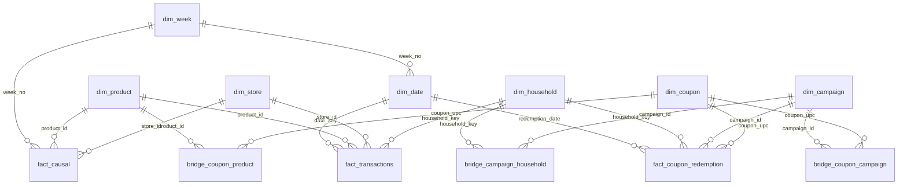

# Schema

Star schema over dunnhumby *The Complete Journey*, loaded into PostgreSQL 16.
All row counts below are from the loaded database, not the source files.

## Entity relationships



| Table | Rows | Grain |
|---|---:|---|
| `fact_causal` | 36,771,279 | product × store × week |
| `fact_transactions` | 2,595,732 | basket × product |
| `bridge_coupon_product` | 112,146 | coupon × product |
| `dim_product` | 92,353 | product |
| `bridge_campaign_household` | 7,208 | campaign × household |
| `dim_household` | 2,500 | household |
| `fact_coupon_redemption` | 2,318 | household × day × coupon × campaign |
| `bridge_coupon_campaign` | 1,397 | coupon × campaign |
| `dim_coupon` | 1,135 | coupon |
| `dim_date` | 711 | day |
| `dim_store` | 582 | store |
| `dim_week` | 102 | week |
| `dim_campaign` | 30 | campaign |

445 foreign key constraints (most propagated across partitions) and 7 check
constraints.

## Grain

### `fact_transactions` — one row per (basket, product)

`SALES_VALUE` is the net amount charged; there is no line-item count in the
source, so a basket containing the same product twice appears once with a
summed quantity.

**Primary key: `(date_key, basket_id, product_id)` — natural, no surrogate.**

Phase 0 verified that `(basket_id, product_id)` is unique across all 2,595,732
source rows, with zero duplicates. A surrogate key would add 8 bytes per row and
an index to enforce what the data already guarantees. `date_key` leads the key
only because Postgres requires the partition key to be part of the primary key —
it is not part of the natural key.

### `fact_causal` — one row per (product, store, week)

Promotional exposure: whether a product was on in-store display or in a mailer,
in a given store, in a given week.

**Primary key: `(week_no, product_id, store_id)` — natural, but only after
deduplication.**

Unlike transactions, this triple is **not** unique in the source: 15,245 of
36,786,524 rows are duplicates. The loader collapses them with `DISTINCT ON`,
which is why the table holds 36,771,279 rows. This was missed during profiling
and found during load — see `docs/methodology-notes.md`.

Reconciliation therefore compares against source lines *minus* the recorded
duplicate count, read from `etl_data_quality`. Comparing raw line counts would
report a permanent false failure.

### `fact_coupon_redemption` — one row per (household, day, coupon, campaign)

The only evidence in the dataset of a household *acting* on an offer rather than
receiving one. Small (2,318 rows) but distinct in kind from campaign enrolment.

## The time model

This is the part of the schema most able to be wrong without failing.

### `dim_week` exists because `fact_causal` needs a dimension

`causal_data` is keyed on `WEEK_NO` and has no day column. `dim_date` cannot
serve as its parent: `week_no` is not unique there — 711 days map to 102 weeks.
Without `dim_week`, 36.8M week values would be entirely unconstrained.

### The anchor: day 6 is a Monday, so day 1 is a Wednesday

dunnhumby publishes no calendar start, only `DAY` 1–711. The intuitive choice —
anchor day 1 to a Monday — is wrong, and wrong silently.

The panel does not begin on a week boundary. Week 1 spans days 1–5; week 2 spans
days 6–12. The rule is:

```
week_no = (day + 8) / 7        -- integer division
```

which matches all 2,595,732 source rows with zero exceptions. Anchoring day 1 to
a Monday would shift every derived calendar week two days out of alignment with
`WEEK_NO` — the exact column `fact_causal` is joined on. Joins would still
succeed and still return rows. They would return the wrong rows.

Weeks 1 and 102 are both partial (5 and 6 days), flagged by
`dim_week.is_partial_week`.

**Elapsed intervals, month boundaries and year-over-year comparisons are real.
Weekday labels are a modelling convention.** The absolute year (anchored at
2015-01-07) carries no meaning. A claim of the form "sales peak on Saturdays"
would be unsupported by this data, and the project does not make one.

### How the rule is enforced, and where it is not

| Table | Guard | Mechanism |
|---|---|---|
| `fact_transactions` | Recomputation | Every staged row's `week_no` is recomputed from `day` and the load fails on a single disagreement |
| `dim_date` | Schema constraint | `CHECK (week_no = (day_number + 8) / 7)` |
| `fact_causal` | Referential + domain | FK to `dim_week`, plus a load assertion that every staged week exists there |

**`fact_causal` gets referential and domain enforcement rather than
recomputation, and the reason is a constraint of the source, not a design
preference: `causal_data` has no day column, so there is nothing to recompute
`week_no` from.** The FK to `dim_week` is what guarantees its 36.8M week values
stay inside the same time model `dim_date` defines.

The chain is: source `week_no` ≡ derived rule ≡ `dim_week` ← `fact_causal` FK.

## Partitioning

### `fact_causal` — range on `week_no`, 102 partitions

This is where partitioning earns its place. Campaign-window and weekly queries
filter on exactly the partition key, pruning ~99% of 36.8M rows. Partitions
average ~360k rows.

The primary key is created **after** load, in `40_indexes.sql`, not in the table
DDL. Declaring it inline makes all 102 partitions maintain a unique index across
every inserted row; measured, that ordering cost 1.40× — see
`docs/performance.md`.

### `fact_transactions` — range on `date_key`, monthly, 24 partitions

**Honest note: at 2.6M rows this is close to over-engineering, and the win is
marginal.**

A well-indexed unpartitioned table would perform comparably for most queries
here. Partitions hold ~110k rows each, which is small enough that per-partition
planning overhead is a real counterweight to pruning benefit. It earns its place
on the time-series access pattern — MoM/YoY comparisons and rolling windows
prune cleanly — and not on size.

Phase 2 measures the difference rather than assuming it. If the measurement shows
no benefit, that result goes in `docs/performance.md` as-is.

Unlike `fact_causal`, this table keeps its PK inline: at 2.6M rows the total
insert cost is 52.8s, so deferring it would save seconds while giving up key
enforcement from the first row.

## Phase 0 findings encoded in the schema

Findings that would otherwise live only in a document, and be rediscovered:

| Column | Encodes |
|---|---|
| `fact_transactions.gross_value` | Generated `sales_value - retail_disc`. `retail_disc` is stored negative; the sign is easy to reverse and the result still looks plausible |
| `fact_transactions.is_weighted_item` | Generated `quantity > 1000`. 23,101 rows record weighted goods in **grams**, so any "units sold" metric summing quantity is adding grams to counts |
| `fact_transactions.is_return` | Generated `quantity <= 0`. Returns are **never** negative `sales_value` — there are zero such rows |
| `dim_household.has_demographics` | 801 of 2,500 households (32%) carry demographics but generate 55% of transactions. A **behavioural selection effect, not a coverage gap** |
| `dim_store.has_promo_coverage` | 115 of 582 stores appear in `fact_causal`, but carry 98.6% of transactions; 95.8% of transactions join to promo data |
| `dim_week.is_partial_week` | Weeks 1 and 102 are 5 and 6 days — documented fact, not a data error to "fix" |
| `fact_causal.display`, `.mailer` | `TEXT`, not integer. Categorical codes mixing digits and letters; integer inference silently corrupted them during profiling |

**Money is `NUMERIC(10,2)`, never float.** These columns sum into revenue
figures and binary floating point does not sum money exactly. It turned out to
matter for *comparing* money too: Phase 0 profiled them as `float32` and got
wrong anomaly counts.

## The coupon model

`coupon.csv` holds 124,548 rows but only **1,135 distinct coupons**. It is a
denormalised cross product of coupon × product × campaign, containing 5,164
exactly duplicated rows. Normalised into a dimension and two bridges:

- `dim_coupon` — 1,135 coupons
- `bridge_coupon_product` — 112,146 pairs; median 12 products per coupon, max 14,477
- `bridge_coupon_campaign` — 1,397 pairs; **many-to-many**, since 171 coupons appear in up to 6 campaigns

The many-to-many is why a `campaign_id` column on `dim_coupon` would have been
wrong.

This matters for Phase 6c beyond tidiness. "Was this household offered a coupon
on a product it already buys?" is a finer and differently-selected treatment than
blanket campaign enrolment, and coupon targeting is plausibly correlated with
prior purchasing — selection on past outcomes, which is exactly the confounder
that breaks difference-in-differences.

## Known anomalies

Measured at load against `NUMERIC(10,2)` and recorded in `etl_data_quality`.
The Phase 4 assertion suite reads these values rather than hardcoding them.

| Anomaly | Rows |
|---|---:|
| `quantity > 1000` (weighted goods, grams) | 23,101 |
| `sales_value = 0` (free goods / full coupon coverage) | 18,879 |
| `quantity <= 0` (returns) | 14,466 |
| `retail_disc > 0` (sign anomaly) | 10 |
| `sales_value - retail_disc < 0` (negative gross) | 1 |
| `sales_value < 0` | 0 |

## Operational tables

Outside the star schema, prefixed `etl_`:

- `etl_load_control` — one row per load step; makes the load resumable and idempotent
- `etl_batch_log` — per-partition throughput; `logged_at` uses `clock_timestamp()`, not `now()`, which returns transaction start time
- `etl_data_quality` — quality counts measured at load, read by reconciliation and Phase 4
- `etl_batch_log_baseline` — preserved pre-optimization measurements for `docs/performance.md`
